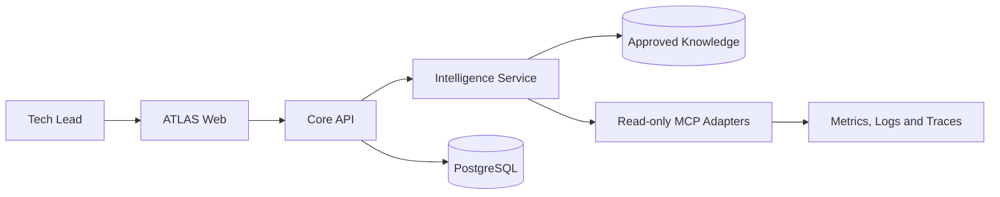

# ATLAS Architecture

## System context



## Repository boundaries

### atlas-ai-tech-lead

Owns the user experience. It collects sanitized technical context and presents hypotheses, architectural components, recommendations, assumptions, and runbooks. It contains no model credentials or direct observability access.

### atlas-core-api

Owns authentication, authorization, diagnostic sessions, validation, audit records, API contracts, and orchestration policies. It is the only backend consumed directly by the frontend.

Suggested modules:

```text
atlas-core-api/
├── application/
├── domain/
├── infrastructure/
├── interfaces-rest/
└── bootstrap/
```

### atlas-intelligence-service

Owns prompts, model routing, retrieval, MCP tool policies, citations, evaluation, and safety controls. Model providers are adapters behind an internal port so Claude, OpenAI, Gemini, or local models can be changed without coupling the core domain.

Suggested modules:

```text
atlas-intelligence-service/
├── model-gateway/
├── rag/
├── mcp-adapters/
├── evaluations/
├── safety-policy/
└── interfaces-rest/
```

### atlas-platform

Owns repeatable environments, infrastructure as code, telemetry pipelines, dashboards, alerts, and local development dependencies.

Suggested structure:

```text
atlas-platform/
├── compose/
├── kubernetes/
├── terraform/
├── opentelemetry/
├── grafana/
└── runbooks/
```

## Primary flow

1. The user submits a sanitized scenario.
2. Core API validates and stores the diagnostic session.
3. Intelligence Service retrieves approved knowledge and optional read-only telemetry.
4. ATLAS produces hypotheses with evidence, confidence, and assumptions.
5. Core API applies policy and returns a structured recommendation.
6. The user reviews the architecture and decides whether to act.

## Guardrails

- No LLM call in a business transaction path
- No model access to secrets, credentials, or unrestricted production data
- MCP tools are read-only in the first phase
- Personally identifiable data is removed before model processing
- Every recommendation includes its evidence and limitations
- Rollback, scaling, deployment, and configuration changes require human approval

## Initial API surface

```text
POST /v1/diagnostics
GET  /v1/diagnostics/{id}
POST /v1/diagnostics/{id}/analysis
GET  /v1/diagnostics/{id}/architecture
GET  /v1/diagnostics/{id}/recommendations
GET  /v1/diagnostics/{id}/runbook
```

## Evolution criteria

Create a new deployable service only when at least one of these conditions exists:

- Independent scaling profile
- Separate security or data boundary
- Different availability target
- Independent release cadence
- Clear ownership by another team

Until then, prefer modules over additional network boundaries.
